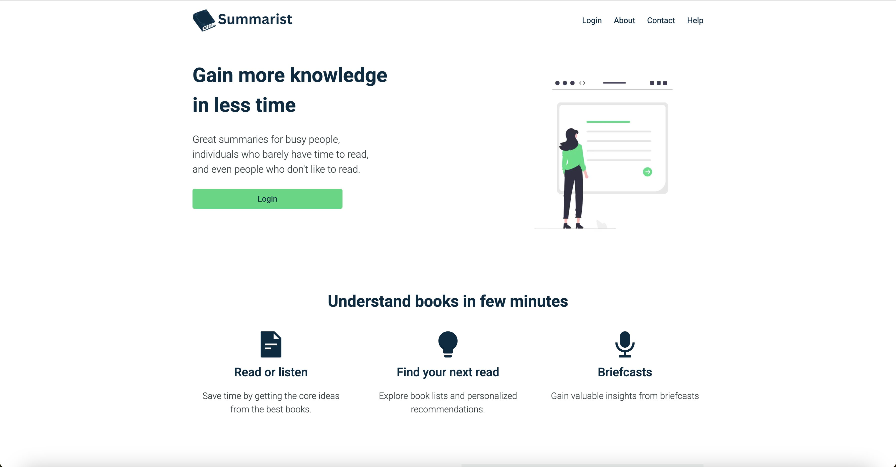
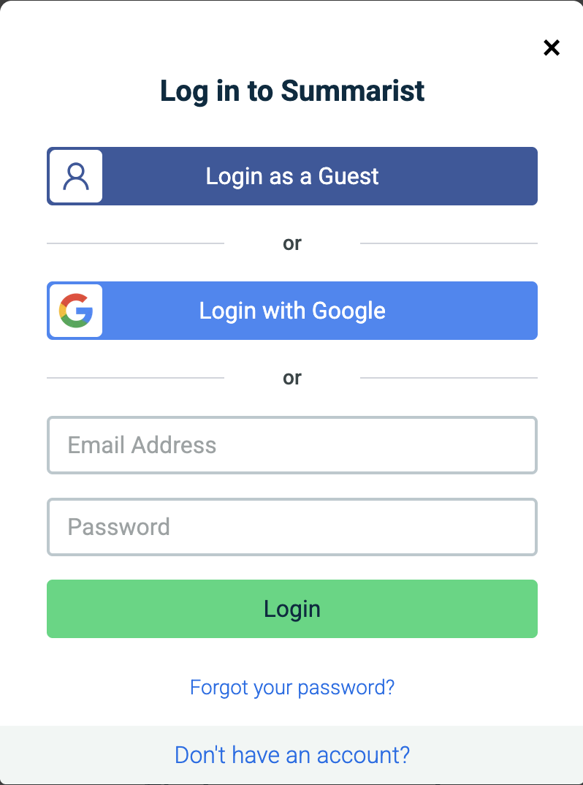
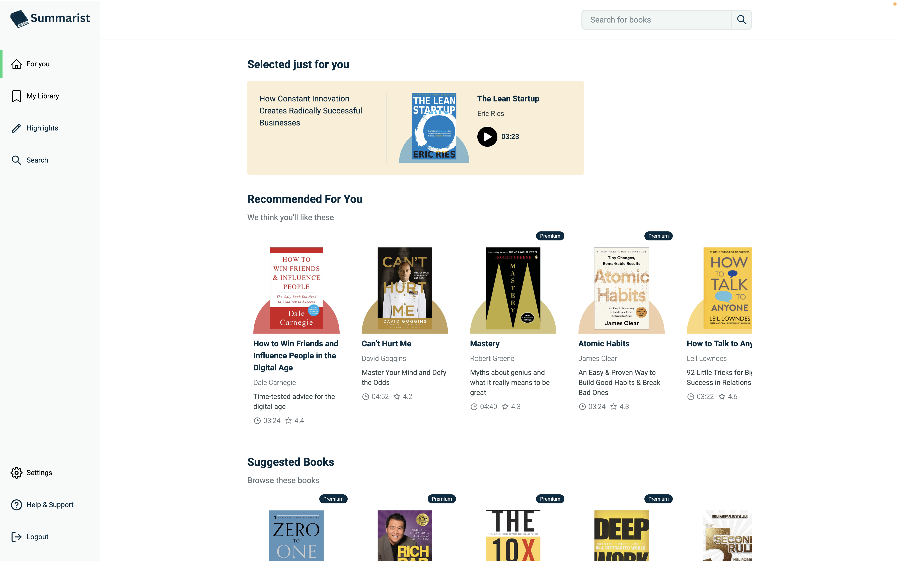
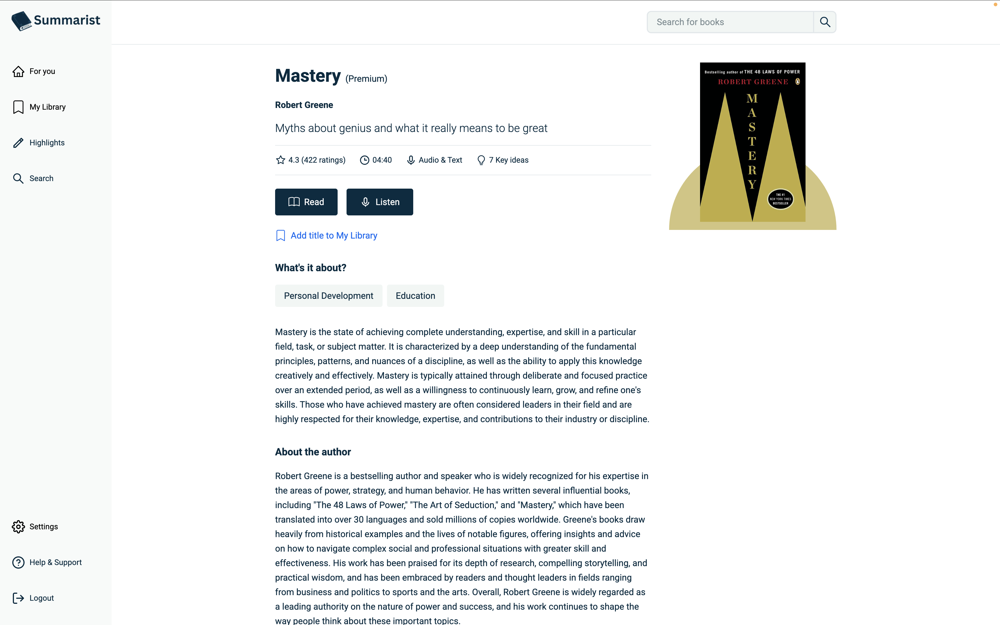
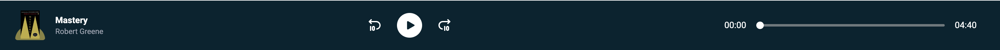
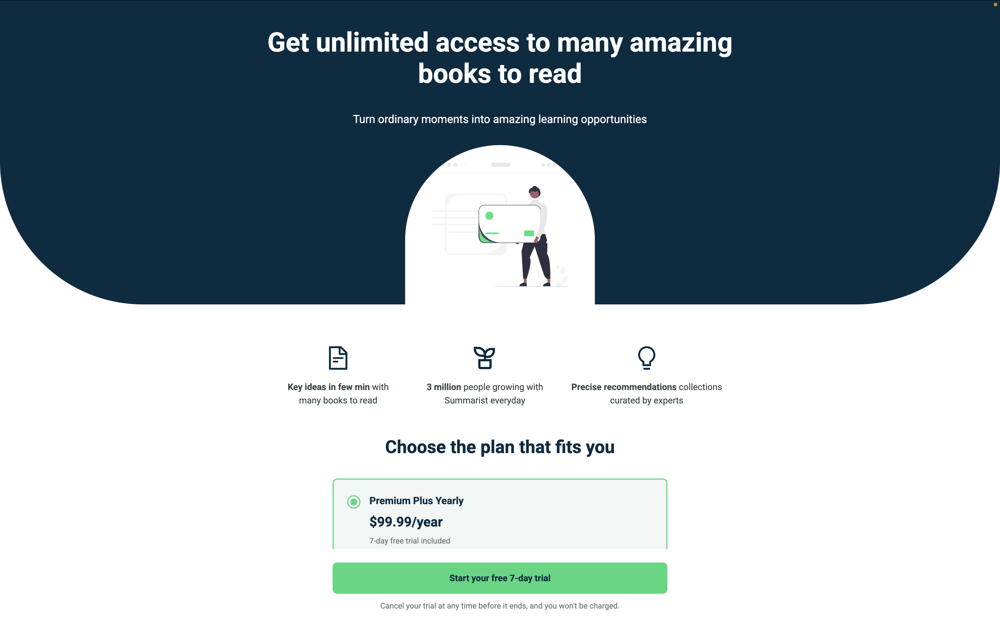

# Summarist

> Gain more knowledge in less time — an audiobook summary app with subscriptions, personalized recommendations, and a built-in audio player.


---

## About

Summarist is a full-stack audiobook summary platform that lets users discover, save, and listen to condensed book summaries. It's built around the idea that key insights from non-fiction books shouldn't require hours of listening — Summarist surfaces the core ideas in a fraction of the time.

The app features a curated home feed with selected, recommended, and suggested books, a personal library where users can track saved and finished titles, and a fully functional in-browser audio player. Authentication supports email/password, Google OAuth, and a guest demo mode, making it easy for anyone to explore without committing to an account.

Subscriptions are gated at the content level — some books require a premium plan to access. Payments are handled through Stripe via the Firebase `firestore-stripe-payments` extension, which manages checkout sessions, customer portals, and subscription status entirely through Firestore listeners. The architecture keeps the frontend thin by delegating all book data to Firebase Cloud Functions and all payment logic to the Stripe extension.

> This project was bootstrapped with `create-next-app` and built out into a production-grade application on top of that foundation.



---

## Features

- **Authentication** — Email/password, Google OAuth, and guest login (demo account)



- **Personalized home feed** — Selected, recommended, and suggested book sections



- **Book detail pages** — Cover art, ratings, key ideas count, author info, and full description



- **In-browser audio player** — Play/pause, skip forward/backward, progress scrubbing, playback speed control, and volume



- **Personal library** — Save books and track finished titles, persisted in Firestore
- **Live search** — Debounced search across book titles and authors with a dropdown results panel
- **Subscription plans** — Two paid tiers (monthly, yearly) with Stripe checkout and customer portal



- **Premium content gating** — Books marked `subscriptionRequired` redirect free users to the plan page
- **Subscription management** — Users can view plan status and open the Stripe customer portal from settings
- **Responsive layout** — Sidebar-based app shell with mobile-friendly navigation
- **Skeleton loaders** — Loading states on all data-fetching pages

---

## Tech Stack

| Category | Technology |
|---|---|
| Framework | Next.js 16.1.4 (App Router) |
| UI Library | React 19.2.3 |
| Language | TypeScript 5 |
| Styling | Tailwind CSS 4 |
| State Management | Zustand 5.0.10 |
| Auth | Firebase Auth (email/password, Google OAuth) |
| Database | Firebase Firestore |
| Backend / API | Firebase Cloud Functions |
| Payments | Stripe (via `firestore-stripe-payments` extension) |
| Icons | react-icons 5.5.0 |
| Linting | ESLint 9 + eslint-config-next |

---

## Project Structure

```
summarist/
├── src/
│   ├── app/                        # Next.js App Router pages
│   │   ├── layout.tsx              # Root layout — fonts, AuthProvider, AuthModal
│   │   ├── page.tsx                # Landing page
│   │   ├── globals.css             # Global Tailwind imports
│   │   ├── home.css                # Landing page scoped styles
│   │   ├── book/[id]/page.tsx      # Book detail — cover, summary, save/play
│   │   ├── player/[id]/page.tsx    # Audio player with controls and progress
│   │   ├── library/page.tsx        # Saved & finished books
│   │   ├── for-you/page.tsx        # Personalized feed (selected/recommended/suggested)
│   │   ├── choose-plan/page.tsx    # Subscription pricing, FAQ, Stripe checkout
│   │   └── settings/page.tsx       # Account info and subscription status
│   │
│   ├── components/
│   │   ├── auth/
│   │   │   ├── AuthModal.tsx       # Login/signup modal (email, Google, guest)
│   │   │   └── AuthProvider.tsx    # Initializes Firebase auth listener on mount
│   │   ├── layout/
│   │   │   ├── Sidebar.tsx         # Fixed nav sidebar (collapsible on mobile)
│   │   │   └── SearchBar.tsx       # Live search with debounced dropdown
│   │   ├── BookCard.tsx            # Reusable book preview card
│   │   ├── SelectedForYou.tsx      # Featured book card (larger layout)
│   │   ├── Navbar.tsx              # Landing page header
│   │   ├── Landing.tsx             # Hero section
│   │   ├── Features.tsx            # Feature highlights and stats
│   │   ├── Reviews.tsx             # User testimonials
│   │   ├── Numbers.tsx             # Metrics section
│   │   └── Footer.tsx              # Site footer
│   │
│   ├── lib/
│   │   ├── firebase.ts             # Firebase app init and exports
│   │   ├── auth.ts                 # Auth functions (login, register, logout, guest)
│   │   ├── library.ts              # Firestore read/write for user library
│   │   ├── stripe.ts               # Stripe checkout and portal URL helpers
│   │   └── audioDuration.ts        # Fetches audio file durations via HTML Audio API
│   │
│   ├── store/
│   │   └── authStore.ts            # Zustand store: user, subscription status, modal state
│   │
│   └── types/
│       └── book.ts                 # Book TypeScript interface
│
├── public/                         # Static assets (logo, images)
├── next.config.ts
├── tsconfig.json
└── package.json
```

---

## Getting Started

### Prerequisites

- Node.js 18+
- npm or yarn
- A Firebase project with:
  - Authentication enabled (Email/Password + Google providers)
  - Firestore database
  - Cloud Functions deployed (the Summarist book API)
  - `firestore-stripe-payments` extension installed
- A Stripe account connected to the Firebase extension

### Clone & Install

```bash
git clone https://github.com/your-username/summarist.git
cd summarist
npm install
```

### Environment Variables

Create a `.env.local` file in the root with your Firebase project credentials:

```env
NEXT_PUBLIC_FIREBASE_API_KEY=your_api_key
NEXT_PUBLIC_FIREBASE_AUTH_DOMAIN=your_project.firebaseapp.com
NEXT_PUBLIC_FIREBASE_PROJECT_ID=your_project_id
NEXT_PUBLIC_FIREBASE_STORAGE_BUCKET=your_project.firebasestorage.app
NEXT_PUBLIC_FIREBASE_MESSAGING_SENDER_ID=your_sender_id
NEXT_PUBLIC_FIREBASE_APP_ID=your_app_id
```

### Run

```bash
npm run dev      # development server at http://localhost:3000
npm run build    # production build
npm run lint     # run ESLint
```

---

## Environment Variables

| Variable | Description | Where to get it |
|---|---|---|
| `NEXT_PUBLIC_FIREBASE_API_KEY` | Firebase project web API key | Firebase Console → Project Settings → Your Apps |
| `NEXT_PUBLIC_FIREBASE_AUTH_DOMAIN` | Firebase auth domain | Firebase Console → Project Settings |
| `NEXT_PUBLIC_FIREBASE_PROJECT_ID` | Firebase project ID | Firebase Console → Project Settings |
| `NEXT_PUBLIC_FIREBASE_STORAGE_BUCKET` | Firebase Storage bucket URL | Firebase Console → Project Settings |
| `NEXT_PUBLIC_FIREBASE_MESSAGING_SENDER_ID` | Cloud Messaging sender ID | Firebase Console → Project Settings |
| `NEXT_PUBLIC_FIREBASE_APP_ID` | Firebase app ID | Firebase Console → Project Settings |

> All variables are prefixed `NEXT_PUBLIC_` and are exposed to the browser. Do not store any secrets here.

---

## Architecture / How It Works

### Auth Flow

Auth state is initialized once at the app root via `AuthProvider`, which calls `initAuth()` on mount. This sets up a Firebase `onAuthStateChanged` listener that writes the user object into a Zustand store (`authStore`). Any component can read `user`, `subscriptionStatus`, or call `openModal()` from the store without prop drilling. `user === undefined` means auth is still resolving (show skeletons); `user === null` means logged out.

### Subscription Status

When a user logs in, `fetchSubscription()` queries the `customers/{uid}/subscriptions` Firestore collection for an active or trialing subscription. It reads the billing interval from the first subscription item to determine the plan tier: yearly → `"premium-plus"`, monthly → `"premium"`, none → `"basic"`. This status gates content access across book detail and player pages.

### Book Data

Books come from an external Firebase Cloud Functions API. The frontend fetches directly from this endpoint — there is no Next.js API layer. Audio durations are computed client-side by loading each audio URL into an HTML `Audio` element and reading `duration`.

### Payments

Stripe checkout is triggered by writing a document to `customers/{uid}/checkout_sessions` in Firestore. The `firestore-stripe-payments` Firebase extension picks this up, creates the Stripe session, and writes the checkout URL back to the document. The client listens for that field to appear and then redirects the user. The Stripe customer portal works similarly via a callable Cloud Function.

### Library Persistence

User library state (saved books, finished books) is stored in Firestore at `users/{uid}/library/saved` and `users/{uid}/library/finished` as arrays of book IDs. All reads and writes happen directly from the client using the Firebase SDK.

---

## Live Demo

A live deployment is not configured in this repository. To deploy, connect the repo to [Vercel](https://vercel.com) and add the environment variables in the Vercel dashboard — no additional configuration is required.

---

## License & Contact

This project is private and not licensed for redistribution.

Built by **Aidan McMurray** — [aidanlmcmurray@gmail.com](mailto:aidanlmcmurray@gmail.com)
